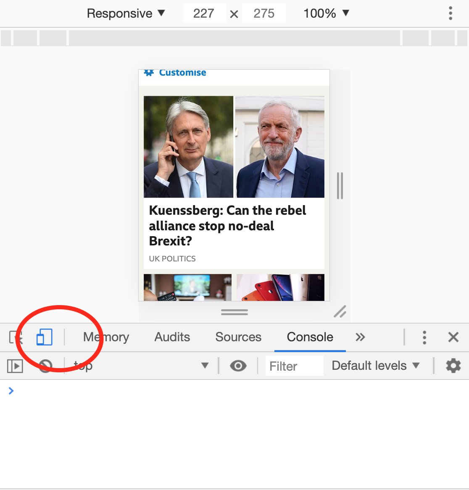
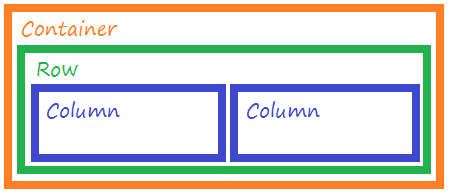
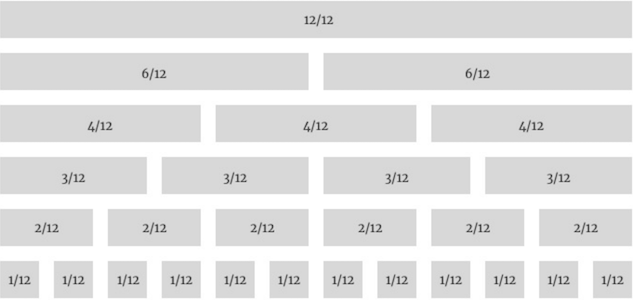
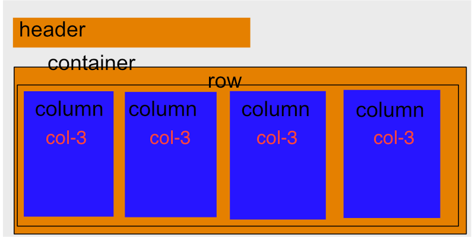
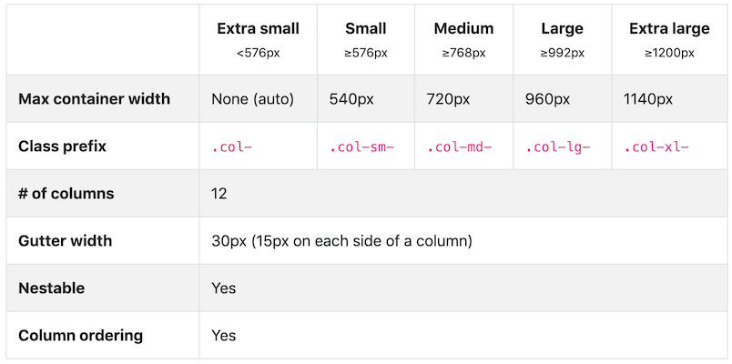
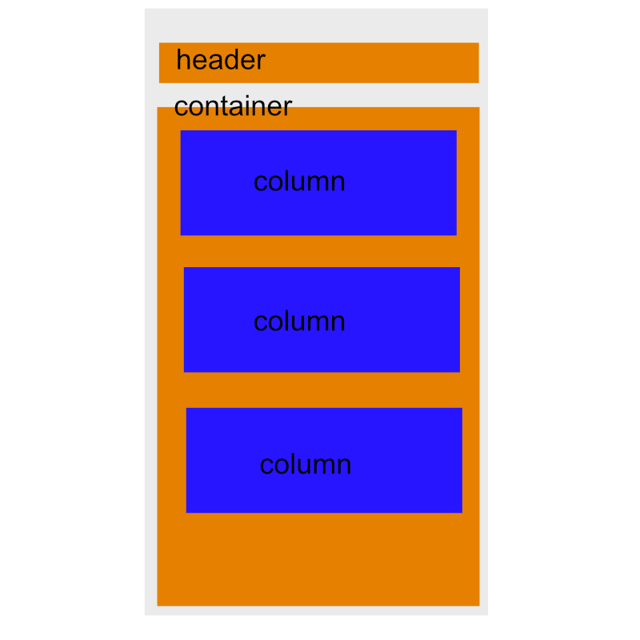
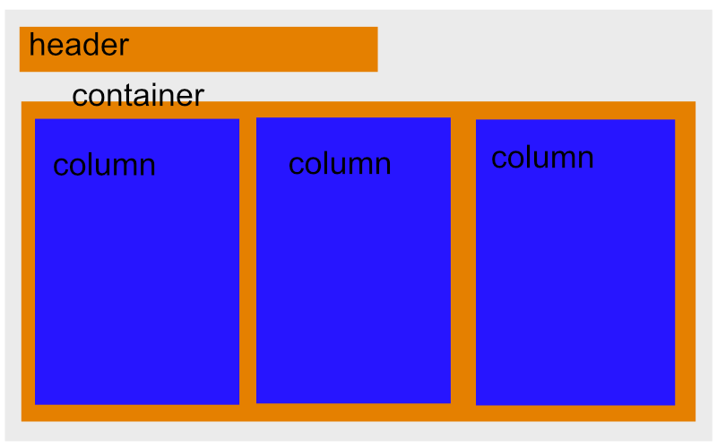

# yrtt_intro_to_frontend

# Responsive Design

### Why Responsive Design?

- Screens don't just come in 1 size (desktop) anymore
- Over 50% of web traffic is via mobile devices
- A huge range of screen sizes
- We expect great user experience on all devices

### Early Days of the Web

You can use the [Web Archive](https://web.archive.org) to see what some websites looked like "back in the day", when people were generally browsing the web on a desktop computer only.

For example, compare:

- the BBC in 2003 - https://web.archive.org/web/20031101000000*/www.bbc.co.uk

- the BBC today

You can use the "mobile view" feature of Chrome Dev Tools to easily view pages at different screen sizes:



### Achieving a layout that changes

Layout changes based on screen size can be achieved with CSS.

A media query is a piece of CSS that ONLY gets applied if a condition is met

One of the early uses was to allow developers to apply different styles when the document was being rendered for print

```css
@media only screen and (max-width: 200px) {
  body {
    background-color: lightblue;
  }
}
```

CSS inside the above query would be applied up until the max-width (of the screen) of 200px.

A CSS file can contain multiple media queries:

```css
body {
  background-color: red;
}

@media only screen and (max-width: 1200px) {
  body {
    background-color: green;
  }
}

@media only screen and (max-width: 1000px) {
  body {
    background-color: #ff4455;
  }
}

@media only screen and (max-width: 800px) {
  body {
    background-color: yellow;
  }
}

@media only screen and (max-width: 600px) {
  body {
    background-color: lightblue;
  }
}
```

In the above example, at 100px wide, technically all the media query conditions would be true. Yet, because `@media only screen and (max-width: 600px)` comes last in the file, this is the one which would finally be applied.

### Further Resources

[In depth Google developer docs on Responsive Design](https://developers.google.com/web/fundamentals/design-and-ux/responsive)

[The A11y Project](https://a11yproject.com/) - Information on making our websites fully accessible

[A Gallery of Media Queries used to great effect](https://mediaqueri.es/)

[More inspiration for responsive design](https://responsivedesign.is/examples/)

[9 Basic Principles for Responsive Design](https://blog.froont.com/9-basic-principles-of-responsive-web-design/)

[CSS Tricks guide to Flexbox](https://css-tricks.com/snippets/css/a-guide-to-flexbox/) - Flexbox is great for responsiveness, and is particularly useful on a smaller scale than a full layout, e.g. a gallery of photo thumbnails that need to shuffle onto new lines as the page size decreases. Worth checking out.

[Learn CSS Flexbox with Flexbox Froggy](https://flexboxfroggy.com/)

[Free CSS Grid course from Wes Bos] https://cssgrid.io/

# Bootstrap CSS Framework

### What is a CSS Framework?

- CSS someone else has written

- It's just a CSS file!

- The CSS file applies styles to elements and classes. When you use specific elements and classes, the styles will be applied

- You write the markup to "fit" the CSS framework

### Introducing Bootstrap

- A CSS Framework created by Twitter

- Currently on Version 4

- Allows you to create components and organise layout

- Responsive is built-in

### CDNs

- Content Delivery Network

- Files hosted on servers around the globe, close to the location of your end user

- Save space on your server, load from an optimised server closer to you client's location

- Caching mechanisms for faster delivery

### Including Bootstrap in a project

- Using the [Bootstrap Documentation](https://getbootstrap.com/docs/4.3/getting-started/introduction/) copy the `<link>` to include in the `head` section of your HTML:

```html
<head>
  <link
    rel="stylesheet"
    href="https://stackpath.bootstrapcdn.com/bootstrap/4.3.1/css/bootstrap.min.css"
    integrity="sha384-ggOyR0iXCbMQv3Xipma34MD+dH/1fQ784/j6cY/iJTQUOhcWr7x9JvoRxT2MZw1T"
    crossorigin="anonymous"
  />

  <link rel="stylesheet" href="styles.css" />
</head>
```

- Include your own stylesheet **below**, if you are using one.

### Bootstrap components

Bootstrap provides styling for many [components](https://getbootstrap.com/docs/4.3/components/alerts/).

If you want a Button, for example, find the [documentation on Buttons](https://getbootstrap.com/docs/4.3/components/buttons/) and include one of the HTML snippet provided:

```html
<button type="button" class="btn btn-secondary">
  Click Here!
</button>
```

### 12-Column grid layout

#### Containers, Rows and Cols

- Responsive, mobile first fluid grid system

- Lets you split the page into 12 columns

- Containers, rows and columns



The containter provides the initial centering. All rows and columns must live inside a container.

```html
<body>
  <div class="container"></div>
</body>
```

A row lives inside a container. A container may have multiple rows.

```html
<body>
  <div class="container">
    <div class="row"></div>
  </div>
</body>
```

Columns live inside a row.

Bootstrap allows you to define a maximum of **12 columns per row**.

If you want just 2 columns per row, as above, then you must specify that your columns are 6 units wide.



The markup for a 2-column layout would be:

```html
<body>
  <div class="container">
    <div class="row">
      <div class="col-6"></div>
      <div class="col-6"></div>
    </div>
  </div>
</body>
```

Design and markup for a 4-column layout may look like this:



```html
<body>
  <div class="container">
    <div class="row">
      <div class="col-3">
        Some content
      </div>
      <div class="col-3">
        Some more content
      </div>
      <div class="col-3">
        More text here
      </div>
      <div class="col-3">
        Our final column
      </div>
    </div>
  </div>
</body>
```

### Responsive Design with Bootstrap

- Bootstrap is Mobile first

- The column widths will be applied to mobile and any sizes above

- We need to provide alternative column widths for the varying different screen sizes.



- We need to think: "How should the layout look on mobile, and how should it change when the screen gets bigger?"

For example, a layout design on mobile and tablet may look like this:

##### Mobile



##### Tablet and larger



The corresponding markup:

```html
<body>
  <div class="container">
    <div class="row">
      <div class="col-12 col-sm-4">
        Some content
      </div>
      <div class="col-12 col-sm-4">
        Some more content
      </div>
      <div class="col-12 col-sm-4">
        More text here
      </div>
    </div>
  </div>
</body>
```

`col-12` class will be applied on XS screens as it is the default, and on SM screens and above the `col-sm-4` class will be applied.

### Including your own CSS too

Using a framework doesn't mean you can't add styles of your own.

If you need to add your own styles, use your own classes or IDs to target elements.

Don't "hook on" to the Bootstrap classes.

```html
<body>
  <div class="container">
    <div class="row">
      <div class="col-12 purple-area">
        Some content
      </div>
    </div>
  </div>
</body>
```

Your own CSS:

```css
.purple-area {
  background-color: purple;
}
```

### More Resources

The following videos may help embed the core HTML knowledge:

HTML5 Facts and Myths - [https://www.smashingmagazine.com/2010/09/html5-the-facts-and-the-myths/](https://www.smashingmagazine.com/2010/09/html5-the-facts-and-the-myths/)

(For those interested in the frontend - [Smashing Magazine](https://www.smashingmagazine.com/) is a good resource to bookmark.)

[Bootstrap Documentation](https://getbootstrap.com/docs/4.3/getting-started/introduction/)

[HTML5 Cheatsheet](https://websitesetup.org/html5-cheat-sheet/)

[CSS Cheatsheet](https://adam-marsden.co.uk/css-cheat-sheet)

[How does CSS actually work?](https://developer.mozilla.org/en-US/docs/Learn/CSS/First_steps/How_CSS_works)

[Inheritance, cascading, and specificity in CSS explained](http://altitudelabs.com/blog/quick-guide-to-understanding-css/)

